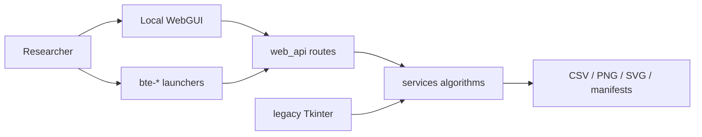

# bioelectronics_toolkit

[](https://github.com/guangqingy/bioelectronics_toolkit/actions/workflows/ci.yml)
[](https://www.python.org/downloads/)
[](./LICENSE)
[](https://docs.astral.sh/ruff/)
[](https://www.conventionalcommits.org)


## Who This Is For

`bioelectronics_toolkit` is for researchers who need a local, inspectable way to
turn common bioelectronics lab files into reproducible figures, CSV exports,
and run manifests. It is intentionally desktop-first: the WebGUI is the
canonical surface for day-to-day analysis, while shared `services/` modules keep
the scientific logic testable and reusable from launchers, scripts, and future
automation.

A collection of desktop GUIs and a lightweight Flask web app for processing
data from common bioelectronics and electrophysiology instruments. Tools cover
electrochemistry (photocurrent / photovoltage), EMG and patch-clamp recordings
(Axon `.abf`, Intan `.rhd`), fluorescence imaging (TIFF, LIF), histology
naming, and CSV trace review.

The desktop GUIs are built on Tkinter + matplotlib and run on macOS, Linux and
Windows. The web app exposes the most complete browser-based versions of these
workflows. For new feature work, the WebGUI is the canonical reference for
output contracts, cached settings, file profiles, background jobs, and run
manifests. The desktop GUIs remain supported standalone tools, but some older
desktop workflows are intentionally thinner than their WebGUI equivalents.



## Features

The commands below are stable user entry points after `pip install -e .`. GUI
commands open the corresponding WebGUI page by default; the older Tkinter
windows remain available with `--legacy` and live under `desktop_apps/legacy/`.
The source launcher modules are grouped under `desktop_apps/launchers/`.

### Patch-clamp / `.abf` analysis

| Command | What it does |
| --- | --- |
| `bte-abf-batch` | Batch-process folders of `.abf` files, parse `{main}_{treat}_sample_..._.abf` filenames, optional reorganization and segment CSV export. |
| `bte-abf-peaks` | Interactive peak detection on ABF sweeps. |
| `bte-abf-sweep` | Quick visualization of individual ABF sweeps. |
| `bte-abf-pc-viewer` | Photocurrent-specific viewer with stim alignment. |
| `bte-abf-pc-figure` | Generates publication-quality photocurrent figures. |

### Electrochemistry

| Command | What it does |
| --- | --- |
| `bte-echem-pc` | Photocurrent waveform analysis and plotting. |
| `bte-echem-pv` | Photovoltage waveform analysis and plotting. |

### EMG / Intan

| Command | What it does |
| --- | --- |
| `bte-rhd-viewer` | Viewer for Intan `.rhd` recordings. |
| `bte-emg-peaks` | Manual / semi-automatic peak selection on EMG traces. |

Intan `.rhd` parsing is provided by the vendored reference parser under
`vendor/intan/`. `bte-emg-viewer` remains as a backward-compatible alias for
`bte-rhd-viewer`.

### Fluorescence imaging

| Command | What it does |
| --- | --- |
| `bte-fl-roi` | ROI-based intensity analysis on TIFF stacks. |
| `bte-fl-lut` | Lookup-table editor / preview. |
| `bte-fl-gif` | Convert multi-page TIFFs to GIFs for sharing. |

### Misc utilities

| Command | What it does |
| --- | --- |
| `bte-csv-viewer` | Browse and overlay CSV traces in a folder. |
| `bte-histology` | Standardize histology naming and run direct ETS ROI marker analysis. |

### Web app

`web_app.py` is a Flask app that wraps most of the analysis routines above
behind a unified browser UI. See [`WEB_README.md`](./WEB_README.md) for the
internal architecture (route modules, templates, shared helpers, API response
contracts, background jobs, and local cache behavior).

The WebGUI is designed for desktop browsers (Chrome, Edge, Firefox, or Safari).
Mobile and tablet layouts are not currently supported.

```bash
python3 web_app.py
```

Then open `http://127.0.0.1:7433`.

## Installation

Requires Python 3.10+ (3.11 recommended).

```bash
# 1. clone
git clone git@github.com:guangqingy/bioelectronics_toolkit.git
cd bioelectronics_toolkit

# 2. create a virtual environment (optional but recommended)
python3 -m venv .venv
source .venv/bin/activate          # on Windows: .venv\Scripts\activate

# 3. install dependencies
pip install -e .
```

For a reproducible Python 3.12 setup matching the checked lock file, use:

```bash
pip install -c requirements-lock.txt -e ".[dev]"
```

CI tests normal dependency resolution on Python 3.10, 3.11, and 3.12. The
`requirements-lock.txt` file records a known-good Python 3.12 dependency set for
release and reproduction checks.

Tkinter is part of the Python standard library on macOS and Windows. On Linux
you may need to install it explicitly (e.g. `sudo apt install python3-tk`).

## Configuration

The toolkit ships with a tiny config layer (`config.py`) so paths and other
machine-specific settings stay out of the source.

```bash
cp config.example.json config.json   # then edit config.json
```

Currently supported keys:

| Key | Meaning | Default if unset |
| --- | --- | --- |
| `default_start_dir` | Initial folder shown by every GUI's file/folder picker | The repo root |

`config.json` is gitignored, so your local edits never leak into commits.

The Web GUI also creates local cache files while you work:

| Path | Meaning |
| --- | --- |
| `web_gui_settings.json` | Global and per-view default parameters for the local Web GUI. |
| `.dataprocess_cache/file_profiles.json` | Per-project, per-file cached UI settings. |
| `.dataprocess_cache/runs/` | Saved run manifests used by the Runs page and package/report tools. |

These files are gitignored. Use
[`web_gui_settings.example.json`](./web_gui_settings.example.json) as the
documented settings shape.

## Running desktop tools

The WebGUI is the default desktop surface. Use the installed `bte-*` commands
for day-to-day work:

```bash
bte-abf-batch
bte-echem-pc
bte-fl-roi
# ...etc
```

To run the old Tkinter window for one-off legacy work, add `--legacy`:

```bash
bte-fl-roi --legacy
```

For source-tree execution without installing entry points, run launcher modules
with `python3 -m`, for example:

```bash
python3 -m desktop_apps.launchers.fluorescence_roi_gui
python3 -m desktop_apps.launchers.fluorescence_roi_gui --legacy
```

If a legacy tool complains about missing dependencies (e.g. `pyabf`,
`pyserial`), make sure your virtualenv is active and `pip install -e .` ran
without errors.

Installed commands include normal CLI help:

```bash
bte-abf-batch --help      # WebGUI launcher options
bte-abf-batch --legacy    # force the old Tkinter window when available
bte-web --help            # Flask/WebGUI entry point
```

## Try It In 30 Seconds

The repository includes tiny synthetic examples under [`examples/`](./examples/)
so a fresh clone can exercise the UI without lab data:

```bash
pip install -e .
bte-web --self-check
python3 web_app.py
```

Then open `http://127.0.0.1:7433` and try:

| File | Suggested page |
| --- | --- |
| `examples/sample_patch_clamp.abf` | ABF viewer / peak detection |
| `examples/sample_echem_photocurrent.csv` | Photocurrent or CSV viewer |
| `examples/sample_fluorescence_stack.tif` | TIFF / ROI / GIF pages |

Additional screenshots:


## Pipeline Runner

The Pipeline Runner is catalog-driven by [`pipelines/registry.json`](./pipelines/registry.json).
The default category is a runnable bundled example that reads only
[`examples/`](./examples/) data and writes CSV/JSON/PNG artifacts. Additional
categories catalog project-specific workflows; entries that require private
local project data are marked `Local script missing` until that script tree is
present.

## Project layout

```text
bioelectronics_toolkit/
├── README.md                       # this file
├── requirements-lock.txt            # known-good Python 3.12 dependency lock
├── LICENSE                         # MIT
├── CODE_OF_CONDUCT.md               # community behavior expectations
├── config.py                       # config loader
├── config.example.json             # config template (copy to config.json)
├── web_gui_settings.example.json    # Web GUI local settings template
├── dev_scripts/                    # maintainer-only repository scripts
├── .gitignore
│
├── desktop_apps/
│   ├── launchers/                  # thin WebGUI/CLI entry modules
│   ├── web_launcher.py             # maps desktop commands to WebGUI pages
│   └── legacy/                     # historical Tkinter applications
├── vendor/intan/                   # vendored Intan `.rhd` reference parser
├── examples/                       # tiny synthetic demo data
│
├── web_app.py                      # Flask app entry point
├── web_api/                        # route modules per domain
├── services/                       # shared processing logic used by UI surfaces
├── web_templates/                  # Jinja templates
├── web_static/                     # CSS / JS assets
├── WEB_README.md                   # web-app architecture notes
├── docs/                           # repository structure and parity notes
│   └── pipelines/                  # data-processing pipeline docs
├── tests/                          # pytest/unittest-compatible contract tests
├── pipelines/                      # canonical WebGUI pipeline registry
│   └── examples/                   # self-contained public pipeline scripts
```

## Development notes

- The web app is layered into thin `register_*_routes(app, ctx)` modules under
  `web_api/`. New tools should follow the contract documented in
  [`WEB_README.md`](./WEB_README.md).
- Repository organization and desktop/Web parity notes are indexed in
  [`docs/README.md`](./docs/README.md).
- Shared algorithms should live under `services/` before they are reused by
  both WebGUI routes and desktop entry points. Fluorescence stack export, ROI
  metrics, basic TIFF-to-GIF rendering, CSV trace merging, electrochemistry
  parsing/detection, ABF peak/baseline helpers, EMG peak helpers, and RHD
  channel/merge helpers now use this layer. Thin user-facing launchers live in
  `desktop_apps/launchers/`; large historical Tkinter apps live under
  `desktop_apps/legacy/`.
- `bte-fl-lut` opens the WebGUI fluorescence page by default, but its dedicated
  LUT editor still lives in `desktop_apps.legacy.fluorescence_lut_gui` until
  `services/fluorescence/lut.py` is added.
- Pipeline metadata lives in [`pipelines/`](./pipelines/). Pipeline-level
  documentation (per analysis flow) lives under
  [`docs/pipelines/`](./docs/pipelines/).
- Before committing Web GUI changes, run:

  ```bash
  python3 -m ruff check .
  python3 -m ruff check services tests desktop_apps/web_launcher.py desktop_apps/launchers --select E,F,W,I --ignore E402
  python3 -m ruff check web_api --select F --ignore E402
  python3 -m compileall -q -f $(git ls-files '*.py' | grep -v '^\.dataprocess_cache/')
  bte-web --self-check
  python3 -m pytest tests --ignore=tests/e2e
  python3 dev_scripts/check_analysis_scripts.py
  python3 dev_scripts/check_no_pyplot.py
  ```

- CI intentionally applies two lint levels: a whole-repository baseline for
  fatal syntax/undefined-name issues, and a stricter gate for maintained
  `services/`, `tests/`, and desktop launcher code. Web API modules also run a
  stricter unused-name/import gate. Historical Tkinter files under
  `desktop_apps/legacy/` are kept out of the strict style gate until they are
  ported or retired.

## Contributing

Issues and pull requests are welcome. See [`CODE_OF_CONDUCT.md`](./CODE_OF_CONDUCT.md)
and [`CONTRIBUTING.md`](./CONTRIBUTING.md) for the workflow (branch naming,
Conventional Commits, pre-commit hooks, CI expectations).

## Changelog

Notable changes to each release are tracked in [`CHANGELOG.md`](./CHANGELOG.md).

## Citing this work

If you use `bioelectronics_toolkit` in academic work, please cite it via the
metadata in [`CITATION.cff`](./CITATION.cff). GitHub renders a "Cite this
repository" button on the right sidebar that copies a ready-to-paste BibTeX
or APA entry. Zenodo metadata is prepared in [`.zenodo.json`](./.zenodo.json);
the version DOI should be added here and to `CITATION.cff` after the repository
owner enables Zenodo for a tagged release.

## License

Released under the [MIT License](./LICENSE).
