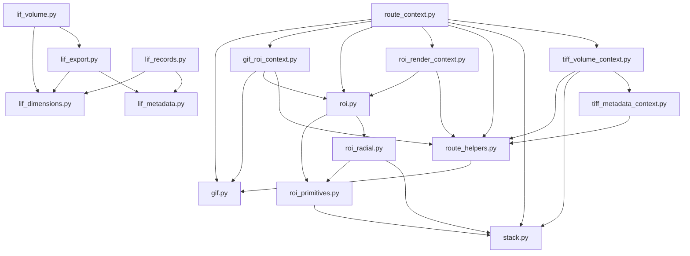

# Fluorescence Service Modules

This package is intentionally split by workflow, but it is now large enough
that new code should land in the right module instead of adding another nearby
file. Prefer extending an existing module unless the new code is a distinct
workflow with its own public API and tests.

## Where Do I Add My Code?

- Add a new LIF metadata field, timestamp parser, or record sorting rule -> `lif_metadata.py`.
- Change LIF dimensions, calibration, channel labels, or scan orientation -> `lif_dimensions.py`.
- Change LIF file loading, cache behavior, or plane lookup -> `lif_records.py`.
- Change LIF TIFF/ImageJ export naming, metadata, LUTs, or manifests -> `lif_export.py`.
- Change LIF 3D point-cloud generation or exported HTML viewer -> `lif_volume.py`.
- Change basic TIFF stack export, denoise/background processing, Fiji macros, or display settings -> `stack.py`.
- Change simple TIFF-to-GIF frame rendering, LUTs, scale bars, timestamps, or slice selection -> `gif.py`.
- Change GIF ROI polygons, crop rectangles, ROI timecourse helpers, kymograph helpers, or heatmap smoothing -> `gif_roi_context.py`.
- Change ROI pair discovery, first-page loading, stack ROI timecourse computation, or reference normalization -> `roi.py`.
- Change ROI geometry or scalar ROI metrics -> `roi_primitives.py` (re-exported through `roi.py` for older callers).
- Change concentric/radial ROI ring analysis -> `roi_radial.py`.
- Change ROI preview images or ROI overlay GIF frames -> `roi_render_context.py`.
- Change generic TIFF/LIF-ish metadata extraction, axis roles, calibration parsing, or TIFF plane lookup -> `tiff_metadata_context.py`.
- Change TIFF 3D point-cloud generation, interlayer fill, density filtering, or embedded 3D HTML -> `tiff_volume_context.py`.
- Change fluorescence 3D export payloads, rotating GIFs, or intensity distribution CSV/plot output -> `volume3d_exports.py`.
- Add a route-visible helper that multiple fluorescence WebGUI routes need -> first put the pure logic in a service module, then expose it through `route_context.py`.
- Add tiny shared route utilities such as bool parsing, display normalization, base64 decoding, or color normalization -> `route_helpers.py`.

`*_context.py` modules are adapters for WebGUI route wiring. Avoid putting new
domain algorithms there unless the algorithm only exists to adapt route
dependencies.

## Module Index

| Module | Responsibility | Same-package dependencies |
| --- | --- | --- |
| `__init__.py` | Package marker and short package docstring for fluorescence services. | None |
| `gif.py` | Core TIFF-to-GIF primitives: plane extraction, slice parsing, LUT application, scale/timestamp drawing, and GIF writing. | None |
| `gif_roi_context.py` | WebGUI-facing GIF ROI helper bundle for polygon/rect normalization, crop handling, ROI metrics, timecourse/kymograph helpers, and ROI preview rendering. | `gif`, `roi`, `route_helpers` |
| `lif_dimensions.py` | LIF dimension, calibration, orientation, channel LUT, and JSON-safe metadata helpers. | None |
| `lif_export.py` | LIF-to-TIFF/ImageJ export planning, metadata/extratags, output naming, manifest rows, and TIFF writing. | `lif_dimensions`, `lif_metadata` |
| `lif_metadata.py` | LIF XML metadata discovery, datetime parsing, image element collection, and record sort keys. | None |
| `lif_records.py` | LIF reader/cache integration, record construction, plane lookup by dimensions, and plane counting. | `lif_dimensions`, `lif_metadata` |
| `lif_volume.py` | LIF 3D point-cloud payload generation and standalone Three.js HTML viewer generation. | `lif_dimensions`, `lif_export` |
| `roi.py` | Public ROI facade for pair discovery, TIFF first-page reading, stack ROI timecourses, shared plot limits, and reference normalization. | `roi_primitives`, `roi_radial` |
| `roi_primitives.py` | ROI geometry and scalar metrics for rectangles/concentric circles, background handling, ratios, and metric presentation modes. | `stack` |
| `roi_radial.py` | Concentric/radial ROI ring metrics and paired stack radial rows. | `roi_primitives`, `stack` |
| `roi_render_context.py` | WebGUI ROI rendering helper bundle for reference previews, output folder selection, and ROI-overlay GIF frames. | `roi`, `route_helpers` |
| `route_context.py` | Composition layer that gathers fluorescence services into context dictionaries consumed by route modules. | `gif`, `gif_roi_context`, `roi`, `roi_render_context`, `route_helpers`, `stack`, `tiff_volume_context` |
| `route_helpers.py` | Small shared helpers for route-adjacent image display, LUTs, bool parsing, path-safe names, TIFF pixel-size inference, colors, and base64 payloads. | `gif` |
| `stack.py` | General TIFF stack processing/export service: typed parsing, min/max auto range, denoise/background filters, Fiji macro generation, and settings normalization. | None |
| `tiff_metadata_context.py` | TIFF metadata helper bundle for axes/roles, calibration, GIF scale resolution, array reading, and single-plane extraction. | `route_helpers` |
| `tiff_volume_context.py` | TIFF 3D point-cloud payload and standalone volume HTML generation, including interlayer rendering and density filtering. | `route_helpers`, `stack`, `tiff_metadata_context` |
| `volume3d_exports.py` | Route-independent 3D export service for volume HTML output, rotating GIF output, rotation math, and intensity distribution CSV/plot output. | None |

## Dependency Graph

Modules not shown as outgoing callers in the graph (`__init__.py`,
`lif_dimensions.py`, `lif_metadata.py`, `gif.py`, `stack.py`, and
`volume3d_exports.py`) currently have no same-package imports.
