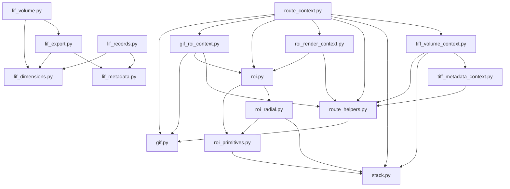

# Fluorescence Service Package

## What Lives In This Package

This package owns reusable fluorescence-domain logic for TIFF/GIF/ROI/LIF/3D
workflows; Web routes should call these modules instead of embedding analysis
or export logic in `web_api/`.

## Where Do I Add My Code?

- Add a new LIF metadata field, timestamp parser, or record sorting rule:
  `lif_metadata.py`.
- Change LIF dimensions, calibration, channel labels, XML calibration, or scan
  orientation: `lif_dimensions.py`.
- Change LIF record loading, cache behavior, image-to-record conversion, or
  plane lookup: `lif_records.py`.
- Change LIF TIFF/ImageJ export naming, metadata, LUTs, extratags, manifests,
  or actual TIFF writing: `lif_export.py`.
- Change LIF 3D point-cloud generation or standalone LIF volume HTML:
  `lif_volume.py`.
- Change basic TIFF stack export, denoise/background processing, Fiji macros,
  or page display settings: `stack.py`.
- Change simple TIFF-to-GIF frame rendering, LUTs, scale bars, timestamps, or
  slice selection: `gif.py`.
- Change GIF ROI polygons, crop rectangles, ROI timecourse helpers, kymograph
  helpers, or heatmap smoothing: `gif_roi_context.py`.
- Change ROI pair discovery, first-page loading, stack ROI timecourses, shared
  y-limits, or reference normalization: `roi.py`.
- Change ROI geometry or scalar ROI metrics: `roi_primitives.py`; keep
  backwards-compatible re-exports in `roi.py` when needed by old callers.
- Change concentric/radial ROI ring analysis: `roi_radial.py`.
- Change ROI preview images, reference previews, or ROI-overlay GIF frames:
  `roi_render_context.py`.
- Change generic TIFF/LIF-ish metadata extraction, axis roles, calibration
  parsing, or TIFF plane lookup: `tiff_metadata_context.py`.
- Change TIFF 3D point-cloud generation, interlayer fill, density filtering, or
  embedded 3D HTML: `tiff_volume_context.py`.
- Change fluorescence 3D export payloads, rotating GIFs, rotation math, or
  intensity distribution CSV/plot output: `volume3d_exports.py`.
- Add a helper needed by multiple fluorescence route modules: first put pure
  logic in the most specific service module, then expose the route bundle from
  `route_context.py`.
- Add tiny route-adjacent utilities such as bool parsing, display normalization,
  cancellable batch progress, base64 decoding, color normalization, or
  path-safe names: `route_helpers.py`.

`*_context.py` modules are adapters for WebGUI route wiring. Avoid putting new
domain algorithms there unless the algorithm only exists to adapt route
dependencies.

## Module Index

| File | Responsibility | Public functions | Imports |
| --- | --- | --- | --- |
| `__init__.py` | Package marker and short package docstring. | None | None |
| `gif.py` | Core TIFF-to-GIF primitives: plane extraction, slice parsing, LUT application, scale/timestamp drawing, and GIF writing. | `import_tifffile`, `import_pillow`, `prepare_plane`, `split_tiff_array_to_planes`, `tiff_frame_count`, `parse_slice_spec`, `read_selected_planes`, `normalize_to_uint8`, `apply_lut`, `draw_scale_bar`, `draw_timestamp`, `render_frame`, `resolve_output_path`, `save_gif`, `make_gif` | None |
| `gif_kymograph.py` | Route-independent GIF ROI kymograph payload generation, histogram/overlay assembly, and plot/CSV serialization. | `build_gif_roi_kymograph_payload` | `matplotlib_utils` |
| `gif_kymograph_export.py` | Route-independent GIF ROI kymograph output saving for plot PNG and heatmap/summary CSV files. | `save_gif_roi_kymograph_outputs` | None |
| `gif_roi_context.py` | WebGUI-facing GIF ROI helper bundle for polygon/rect normalization, crop handling, ROI metrics, timecourse/kymograph helpers, and ROI preview rendering. | `build_gif_roi_context` | `gif`, `roi`, `route_helpers` |
| `lif_dimensions.py` | LIF dimension, calibration, orientation, channel LUT, and JSON-safe metadata helpers. | `dim_int`, `json_safe`, `positive_float`, `nonzero_float`, `unit_to_um_factor`, `calibration_from_scale`, `int_dict`, `display_dims`, `dimension_label`, `plane_dimensions_from_record`, `float_from_settings`, `apply_xml_dimension_calibration`, `xml_metadata_summary`, `channel_lut_names`, `bool_setting`, `orientation_from_settings`, `apply_orientation`, `oriented_counts`, `oriented_calibration` | None |
| `lif_export.py` | LIF-to-TIFF/ImageJ export planning, metadata/extratags, output naming, manifest rows, and TIFF writing. | `imagej_lut`, `imagej_luts`, `tiff_datetime`, `resolution_kwargs`, `export_plan`, `frame_dimension_combinations`, `plane_sequence`, `build_export_metadata`, `build_image_description`, `imagej_extratags`, `imagej_metadata`, `sanitize_filename`, `output_name_for_record`, `unique_output_path`, `manifest_rows`, `export_image_as_tiff` | `lif_dimensions`, `lif_metadata` |
| `lif_metadata.py` | LIF XML metadata discovery, datetime parsing, image element collection, and record sort keys. | `clean_str`, `parse_second`, `apply_ampm`, `candidate_score`, `parse_datetime_text`, `timestamp_from_element`, `collect_image_elements`, `record_sort_tuple` | None |
| `lif_records.py` | LIF reader/cache integration, record construction, plane lookup by dimensions, and plane counting. | `record_from_image`, `clone_records`, `load_records`, `get_plane_by_dimensions`, `get_plane`, `plane_count` | `lif_dimensions`, `lif_metadata` |
| `lif_volume.py` | LIF 3D point-cloud payload generation and standalone Three.js HTML viewer generation. | `lut_rgb`, `volume_indices`, `plane_points`, `build_volume3d_payload`, `volume3d_html` | `lif_dimensions`, `lif_export` |
| `roi.py` | Public ROI facade for pair discovery, TIFF first-page reading, stack ROI timecourses, shared plot limits, and reference normalization. | `import_tifffile`, `collect_pairs`, `read_first_page`, `compute_stack_roi`, `shared_ylim`, `resolve_ref_index`, `normalize_to_reference`, `delta_f_over_f0` plus compatibility re-exports from `roi_primitives` and `roi_radial` | `roi_primitives`, `roi_radial` |
| `roi_primitives.py` | ROI geometry and scalar metrics for rectangles/concentric circles, background handling, ratios, and metric presentation modes. | `shape_type`, `empty_metrics`, `metrics_from_flat`, `circle_geometry`, `ring_count`, `ring_width_px`, `values_2d`, `metrics_2d`, `safe_ratio`, `sequence_number`, `background_mean`, `apply_metric_mode` | `stack` |
| `roi_radial.py` | Concentric/radial ROI ring metrics and paired stack radial rows. | `radial_metrics_2d`, `radial_pair_rows`, `ring_width_px_from_um` | `roi_primitives`, `stack` |
| `roi_render_context.py` | WebGUI ROI rendering helper bundle for reference previews, output folder selection, and ROI-overlay GIF frames. | `build_roi_render_context` | `roi`, `route_helpers` |
| `route_context.py` | Composition layer that gathers fluorescence services into context dictionaries consumed by route modules. | `build_fluorescence_route_contexts` | `gif`, `gif_roi_context`, `roi`, `roi_render_context`, `route_helpers`, `stack`, `tiff_volume_context` |
| `route_helpers.py` | Small shared helpers for route-adjacent image display, LUTs, bool parsing, cancellable batch progress, path-safe names, TIFF pixel-size inference, colors, and base64 payloads. | `apply_lut`, `frame_to_b64`, `select_display_frame`, `parse_bool`, `sanitize_prefix`, `rational_to_float`, `unit_to_um_scale`, `normalize_hex_color`, `infer_pixel_size_um_from_tiff`, `normalize_display_2d`, `decode_base64_payload`, `iter_with_job_progress` | `gif` |
| `stack.py` | General TIFF stack processing/export service: typed parsing, min/max auto range, denoise/background filters, Fiji macro generation, and settings normalization. | `bool_or`, `int_or`, `float_or`, `import_tifffile`, `compute_default_min_max`, `convert_to_export_dtype`, `box_blur2d`, `apply_background_suppression`, `apply_optional_denoise`, `preprocess_stack_image`, `compute_auto_range_with_processing`, `clean_choice`, `read_tiff_as_pages`, `to_macro_path`, `imagej_lut_command`, `build_fiji_macro`, `build_default_settings_for_pages`, `normalize_settings_for_pages`, `build_settings_from_template`, `export_with_settings`, `is_generated_tiff` | None |
| `tiff_metadata_context.py` | TIFF metadata helper bundle for axes/roles, calibration, GIF scale resolution, array reading, and single-plane extraction. | `build_tiff_metadata_context` | `route_helpers` |
| `tiff_volume_context.py` | TIFF 3D point-cloud payload and standalone volume HTML generation, including interlayer rendering and density filtering. | `build_tiff_volume_context` | `route_helpers`, `stack`, `tiff_metadata_context` |
| `volume3d_exports.py` | Route-independent 3D export service for volume HTML output, rotating GIF output/jobs, rotation math, and intensity distribution CSV/plot output. | `Volume3DExportContext`, `volume_payload_from_body`, `export_volume_payload`, `rotation_gif_payload`, `rotation_gif_job_payload`, `distribution_payload`, `rotation_axis_vector`, `rotation_matrix`, `rotation_gif_bytes` | None |

## Dependency Graph

Modules not shown as outgoing callers in the graph (`__init__.py`,
`lif_dimensions.py`, `lif_metadata.py`, `gif.py`, `stack.py`, and
`volume3d_exports.py`) currently have no same-package imports.

## When To Add A New File

Add a new module only when all of these are true:

- You can write a one-sentence responsibility that is independent from existing
  modules.
- The new area is likely to reach roughly 100 LOC with tests, not just a few
  helper functions.
- The public API has a natural name that route modules or other services would
  call directly.
- Keeping the code in an existing module would mix unrelated workflows or push
  that module past the LOC budget.

Otherwise, extend the closest existing module and update this index if its
responsibility changes.
